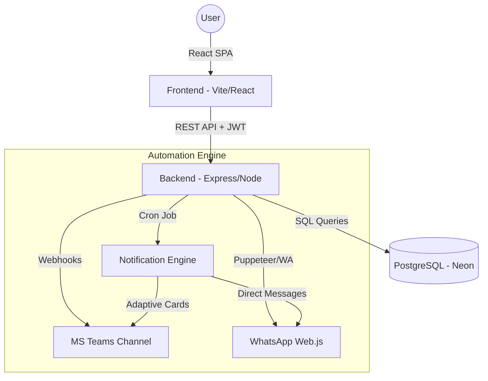

# 🔗 PresenceLink - Smart Presence Platform

Welcome to the comprehensive documentation for **PresenceLink**. This is a professional-grade, white-label solution for team presence management, featuring an elegant UI and robust automation.

---

## 📚 Technical Documentation Hub

For a deeper dive into the system's inner workings, please refer to our specialized guides:

- [🏗️ **Architecture & Data Flow**](./guides/ARCHITECTURE.md): How the pieces fit together.
- [🗄️ **Database Schema**](./guides/DATABASE.md): Tables, relationships, and data dictionary.
- [🔐 **Security & RBAC**](./guides/SECURITY.md): Auth flow and permission levels.
- [🚀 **Developer Guide**](./guides/DEVELOPMENT.md): Coding standards and setup.

---

## 🏗️ System Architecture & Flow

PresenceLink is a full-stack solution designed for high-availability team coordination.

---

## 📖 User Guide: How to use the App

### 1. Authentication
- **Login**: Access with your corporate email and password.
- **Session**: The system uses JWT tokens. Your session remains active for 8 hours.
- **Default Language**: The system defaults to **English**, but you can switch to Spanish or Italian at any time.

### 2. Managing your Calendar
- **Daily Check-in**: Click on any day in the calendar grid. A modal will appear allowing you to select your location (e.g., Office, Home, Vacation).
- **Smart Status Visualization**:
    - 🏢 **Solid Color**: Your confirmed location for that day.
    - 🌫️ **Dashed Border & Reduced Opacity**: Your "Predicted" location based on your defaults. This indicates a "Smart Status" that doesn't require manual confirmation.
- **Navigation**: Use the arrows at the top to switch between months.

### 3. Your Profile & Preferences
- **Appearance**: Toggle between **Light** and **Dark** modes (DaisyUI themes).
- **Language**: Switch the entire interface between **English**, **Spanish**, and **Italian**.
- **iCal Synchronization**: Copy your unique **Personal Calendar URL** to see your presences in Outlook, Google Calendar, or Apple Calendar.

### 4. Magic Fill 🪄 (One-Click Productivity)
The star feature of PresenceLink!
- Go to your **Profile Page**.
- Click the **"Magic Fill"** button.
- The system will automatically populate your future dates based on your personal work pattern (e.g., Mon-Thu Office, Fri Remote).

---

## 🛡️ Administrator Guide (Privileged Options)

### 1. User Management
- **Create/Edit Users**: Assign roles (User, Admin, Superadmin) and departments.
- **Weekend Access**: Enable "Can work weekends" for specific profiles.

### 2. Category Management
- **Custom Icons & Pastel Colors**: Create presence types with a modern, sophisticated palette.
- **Multilingual Support**: Define names in EN/ES/IT for every category.

### 3. White-Label Configuration
You can customize the platform identity in seconds via the `.env` file:
- `VITE_APP_NAME`: Set your product name.
- `VITE_APP_LOGO_URL`: Inject your corporate logo.
- `VITE_APP_COMPANY_NAME`: Branded copyright notices.

---

## 🛠️ Maintenance & Documentation

- **Generate Docs**: `npm run docs`
- **Serve Docs**: `npm run docs:serve` (available at http://localhost:3001)

---

*PresenceLink — Smart presence, connected teams.*
