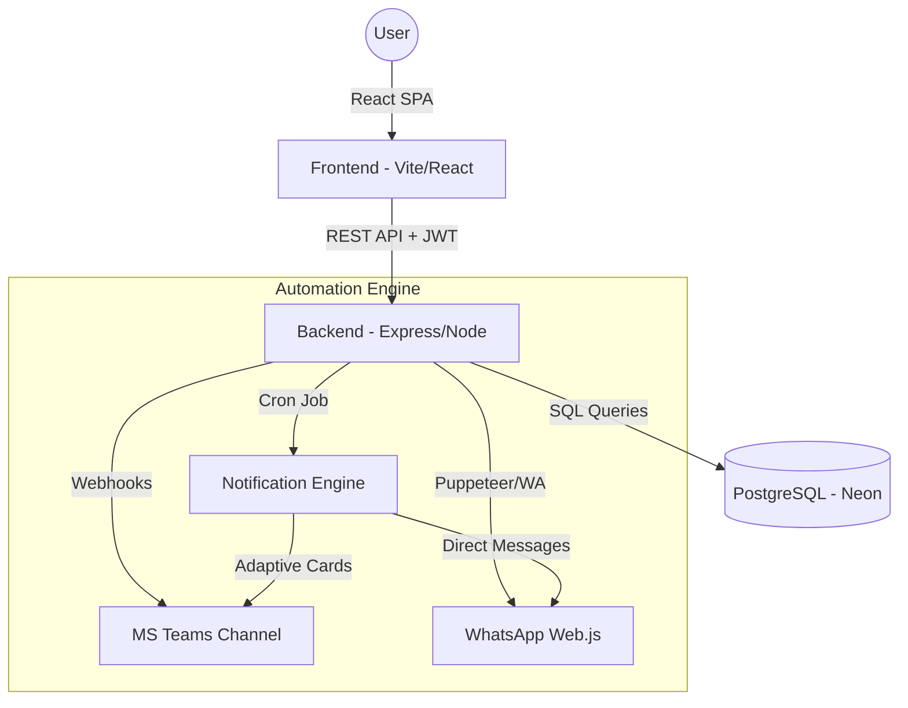

# 🗓️ FAE Calendar - The Ultimate Guide

Welcome to the comprehensive documentation for **FAE Calendar**. This document covers everything from system architecture to a detailed end-user manual and administrator guide.

---

## 📚 Technical Documentation Hub

For a deeper dive into the system's inner workings, please refer to our specialized guides:

- [🏗️ **Architecture & Data Flow**](./guides/ARCHITECTURE.md): How the pieces fit together.
- [🗄️ **Database Schema**](./guides/DATABASE.md): Tables, relationships, and data dictionary.
- [🔐 **Security & RBAC**](./guides/SECURITY.md): Auth flow and permission levels.
- [🚀 **Developer Guide**](./guides/DEVELOPMENT.md): Coding standards and setup.

---

## 🏗️ System Architecture & Flow

FAE Calendar is a full-stack solution designed for high-availability team coordination.



---

## 📖 User Guide: How to use the App

### 1. Authentication
- **Login**: Access with your corporate email and password.
- **Session**: The system uses JWT tokens. Your session remains active for 24 hours.

### 2. Managing your Calendar
- **Daily Check-in**: Click on any day in the calendar grid. A modal will appear allowing you to select your location (e.g., Office, Home, Vacation).
- **Status Icons**:
    - 🏢 **Full Color**: Your confirmed location for that day.
    - 🌫️ **Ghost (Semi-transparent)**: Your "Predicted" location based on your defaults. You don't need to do anything if this is correct.
    - ➕ **Dashed Plus**: An empty day waiting for your input.
- **Navigation**: Use the arrows at the top to switch between months.

### 3. Your Profile & Preferences
Access your profile by clicking your avatar in the top right.
- **Personal Details**: Update your alias, phone number, and professional role.
- **Status Message**: Set a short bio or current status (e.g., "In a meeting until 12:00").
- **Appearance**: Toggle between **Light** and **Dark** modes (DaisyUI themes).
- **Language**: Switch the entire interface between **English**, **Spanish**, and **Italian**.
- **iCal Synchronization**: Copy your unique **Personal Calendar URL** and paste it into Outlook, Google Calendar, or Apple Calendar to see your presences externally.

### 4. Bulk Filling (The "Magic" Button)
Don't want to click every day?
- Go to your **Profile Page**.
- Locate the **"Fill Month"** section.
- Select your "Standard Week" pattern (e.g., Mon-Thu Office, Fri Home).
- Click **"Apply to Month"** to populate the entire month in one click.

---

## 🛡️ Administrator Guide (Privileged Options)

If you have `Admin` or `Superadmin` roles, a gear icon ⚙️ will appear in your sidebar.

### 1. User Management
- **Create Users**: Add new team members, assign them to departments, and set their initial roles.
- **Edit/Delete**: Update any user's profile or remove them from the system.
- **Weekend Access**: Enable "Can work weekends" for specific users to allow them to register presences on Saturdays and Sundays.

### 2. Category Management
The system is fully dynamic. You can:
- **Create Categories**: Add new types of presence (e.g., "Client Site").
- **Custom Icons**: Choose from a library of MUI icons (Home, Work, Beach, etc.).
- **Multilingual Names**: Set names in EN/ES/IT so they appear correctly for all users.
- **Color Coding**: Categories are automatically color-coded based on their icon type for quick visual scanning.

### 3. Department Configuration
- **Teams Webhooks**: Assign a unique Microsoft Teams Webhook URL to each department.
- **Department Defaults**: Set a default location for the whole department (e.g., the Sales team usually works at "HQ Albino").

### 4. Holiday Management
- Register national or corporate holidays.
- **Automatic Block**: Holidays are displayed with a celebration icon 🥳 and prevent the "Unconfirmed" warning in Teams notifications.

---

## 🚀 Installation & Technical Setup

### Prerequisites
- **Node.js 22+**
- **npm 10+**
- **Docker Desktop** (Optional, for containerized deployment)
- **PostgreSQL Database** (Neon.tech recommended)

### Local Manual Setup
```bash
# 1. Install all dependencies
npm install && npm run install:all

# 2. Configure Environment
cp backend/.env.example backend/.env
cp frontend/.env.example frontend/.env

# 3. Launch Services
npm run dev
```

### Docker "One-Click" Setup
```bash
# Build and run in the background
docker compose up --build -d

# Authenticate WhatsApp (Scan the QR code printed in the console)
docker compose logs -f backend
```

---

## ⚙️ Configuration Reference (Environment Variables)

### Backend Settings
| Key | Description |
|---|---|
| `DATABASE_URL` | Connection string for PostgreSQL. |
| `JWT_SECRET` | Secret key for encryption. |
| `WA_WEB_URL` | Base URL of the frontend for WhatsApp QR generation. |
| `WA_CRON_SCHEDULE` | When to send notifications (e.g. `0 18 * * 1-5`). |
| `CORS_ORIGIN` | Allowed domains (e.g. `http://localhost:5173`). |

### Frontend Settings
| Key | Description |
|---|---|
| `VITE_API_URL` | The endpoint where the backend is listening. |

---

## 🛠️ Maintenance & Documentation

- **Generate Docs**: `npm run docs`
- **Serve Docs**: `npm run docs:serve` (available at http://localhost:3001)
- **Clean Project**: `npm run clean`
- **Type Checking**: `npm run type-check`

---

*FAE Calendar — Efficiency through transparency.*
